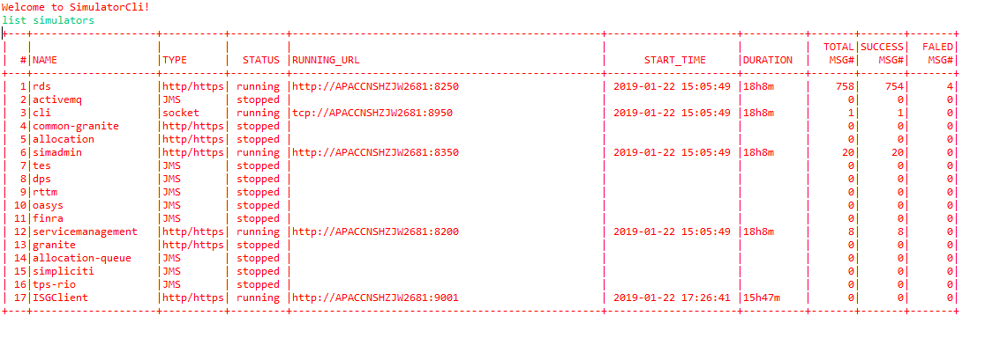
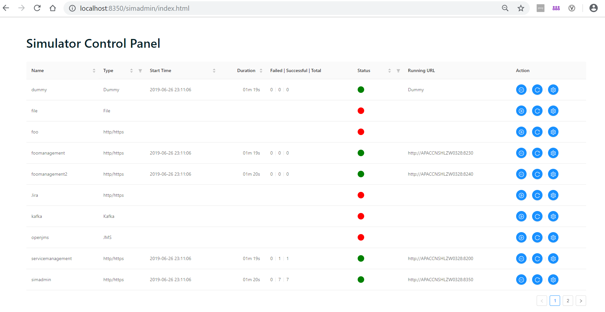

# SmartSimulator
Build status: [](https://travis-ci.org/lujian213/SmartSimulator)

*SmartSimulator* is a generic simulator framework which can be used to simulate the behavior of specific service. It can be used in development or QA stage to reduce dependency and improve productivity.

The simulator itself has no business logic, it can behave/send back response purely based on the rules you defined as scripts.

## 1. Scripts Structure
An instance of SmartSimulator can host many simulator scripts. All these simulator scripts are centralized in a folder and each simulator script is represented as a sub-folder in it.

A simulator script folder can consists of 4 types of files.
###	1.1 init.properties
A properties file define multiple key-value pairs. Besides some common properties, different type of simulators may have different properties. The properties definition follows [apache commons-configuration](http://commons.apache.org/proper/commons-configuration).
###	1.2 *.sim file
sim file defines the request/response pairs. You can treat these pairs as rules. SmartSimulator has no business logic, but uses these rules to behave/send back response. If the incoming request matches the request template, then the simulator will construct the response  based on the response template and send back. Below is a sample of sim file.

```
GET {$url}/hello/{$name} HTTP/1.1

HTTP/1.1 200 OK

Hello! $name

------------------------------------------------------------------

GET {$url}/hi/{$name} HTTP/1.1

HTTP/1.1 200 OK

Good evening! $name

------------------------------------------------------------------

GET {$url}/error HTTP/1.1

HTTP/1.1 301 Moved Permanently
Location: http://www.baidu.com

------------------------------------------------------------------

```

Different request/response pair is seperated by a dotted line
<p><code>
`------------------------------------------------------------------`
</code></p>

Each request/response pair can consist of 1 request template and multiple response templates. Different response template is seperated by the line started with *HTTP/1.1*.

###	1.3 .ignore file
This file is used to specify that this folder is not related with simulator, just ignore it when doing sim file defines the request/response pairs.

###	1.3 lib folder
Each simulator has its own classloader to make it isolated from other simulators to avoid dependency confliction. The lib folder is used to contain simulator own code and dependant jar files.

###	1.4 other sub-folder
Depends on different type of simulator, it can also contain init.properties and .sim files. Outer-level properties and sim rules will be inherited by inner-level. And inner-level properties and rules can overwrite the inherited properties and rules from outer-level.

## 2. Templates
Template (request template and response template) is the core part of sim file to define the rule.
### 2.1 Request Template
Request template by default is a reverse template. Below are some key points of reverse template.

* It is lined based.
* All variables are defined as {$*var_name*}, like *{$name}*.
* Array type variable is ended with *[]*, like *{$a[]}*.
* Variable can set min and max length, like *{$a:3,4}*.
* Variable will be assigned values if the incoming message matched template.


For example, String `GET https://www.abc.com/hello/world HTTP/1.1` matched the template `GET {$url}/hello/{$name} HTTP/1.1`. After the match, variable `url = https://www.abc.com`, and `name = world`.

Another example, String `We have {$name[]} and {$name[]} in the team` matched the template `We have Alice and Bruce in the team`. After the match, variable `name[0] = Alice`, and `name[1] = Bruce`.

Request template has 3 parts: topline, headers, and payload.

*Topline* is one line description about the request. It is protocol specific reverse template. For example, `GET {$url}/hello/{$name} HTTP/1.1` for http protocol.

*Headers* are the required headers in the incoming request. Each header is a reverse template, Like `key: value` or `key: {$value}`. Any key starts with "*" is treated as optional header. Any the key starts with "_" is treated as internal control header. Optional and internal control headers will not be used to match with incoming request headers. Non-internal control headers will be put into context as a name-value pairs for further handling. Current supported internal headers are listed below.

| Key | Value | Comments
| ------ | ------ | ----- |
| _Body-Type | XPath | Payload will be XPath List used to extrat information from actual request payload|
| _Body-Type | JSonPath | Payload will be JSonPath List used to extract information from actual request payload|
| _Body-Type | JSonObject | Payload is a Json object, the actual request payload will be de-serialized to an object with given class name and variable name|
| _Body-Type | Groovy | Payload is a Groovy script used to handle the actual request payload |
| _JSonObject.classname | Java class name | Work with "_Body-Type = JSonObject" to specify which Java class to be used when doing de-serialization |
| _JSonObject.varname | Variable name in context | Work with "_Body-Type = JSonObject" to specify what variable name will the de-serialilzed object to be used in context |

If *_Body-Type* is not set, by default, it will be a normal reverse template.

*Payload* is the main part of the incoming request. Its content is determined by the *_Body-Type* header as mentioned above.
#### 2.1.1 XPath list

Extract the values from payload by XPath and put it into context with the name.

* If *name* ends with *[]*, the value will be an array.
* If *name* starts with *, it is an optional XPath. Otherwise, it is a mandatopry XPath.
* Only if all mandatory XPath are matched, this request is matched. And all the name-value pairs will put into context for further handling.

Example:
```
HTTP/1.1 200 OK
_Bridge-Type: XPath

messageId: //abc:MessageId/text()
dealId[]: //abc:PostEvent//abc:DealID[@SchemeName="foo"]/text()
*conversationId: //abc:ConversationId/text()
```

#### 2.1.2 JSonPath list
Extract the values from payload by JSonPath and put it into context with the name.

* If *name* ends with *[]*, the value will be an array.
* If *name* starts with *, it is an optional JSonPath. Otherwise, it is a mandatopry JSonPath.
* Only if all mandatory JSonPath are matched, this request is matched. And all the name-value pairs will put into context for further handling.

Example:
```
HTTP/1.1 200 OK
_Bridge-Type: JSonPath

author: $.store.book[?(@.price>20)].author
price[]: $.store.book[?(@.author=='J. R. R. Tolkien')].price
*score: $.store.book[?(@.price>20)].score
```
#### 2.1.3 JSon Object

Deserialize the content of the payload with the given class name and put it into context with the variable name for further handling.

Example:
```
HTTP/1.1 200 OK
_Bridge-Type: JSonObject
_JSonObject.classname: a.b.c.d
_JSonObject.varname: dummy

```
#### 2.1.4 Groovy Script

Execute the groovy script in the payload to return a map (name-value pairs) and put into context. If retuen null, it is treated as mis-match.

*Note: When execute the Groovy script, the properties can be referenced from the context.

Example:
```
HTTP/1.1 200 OK
_Bridge-Type: Groovy

def map = new HashMap()
map.put("key1", binding.getVariable("simulator.name") + "1")
map
```

### 2.2 Response Template
Like request template, response template also has 3 parts: topline, headers, and payload.

*Topline* is used to state the begining of a response. It always starts with *HTTP/1.1* (align with the format in fiddler). Then followed by HTTP ret code and description. For example, `HTTP/1.1 200 OK`. Currently, the ret code is only useful in HTTP/HTTPS protocol.

*Headers* are the headers set to the output response. Each header is a Velocity template, like `key = $name`. The variables in the Velocity template can come from simulator properties, or extracted variables when matching the request.

*Note: Since Velocity template does not support "." in variable name, all "." in property names or header names are replaced by "_".

Any key starts with "_" is treated as internal control header. All properties, extracted name-value pairs and response headers will put into context to generate response body. Non-internal control headers will be put into response headers if there is. By default, the response body is a Velocity Template. Below internal control headers are used to give other choices.

*Note: When evaluating Velocity template, there is a pre-defined variable "SimUtils" with value of Class *io.github.lujian213.simultor.util.SimUtils* in context to provide some easy functions.

| Key | Value | Comments
| ------ | ------ | ----- |
| _Bridge | *Some URL* | Instead of having the in-line reponse body, use some URL pointing to a file|
| _Bridge.Type | VM | Specify the URL pointing to is a Velocity Template|
| _Bridge.Type | Groovy | Work with _Bridge. Specify the URL pointing to is a Groocy script|
| _Bridge.Type | *Other Value* | Work with _Bridge. Specify the URL pointing to is a txt content|
| _Class.Name | *Some class name* | Specify what class will be initailized. |
| _Method.Name | *Method name in class* | Work with _Class.Name. Specify which method in above class will be invoked |
| _Conetnt-Type | *Content Type* | Work with _Class.Name and _Method.Name to help decide how to serilaize the return value. See the Content-Type value in http req/resp. |
| _Wait.Time | *milli-seconds* | This will make the simulator sleep/wait for specific milli-seconds. It is useful to insert a wait response between two other responses. |
| _response.targetSimulator | *Simulator name* | This header can be used to send out response through some other specific simulator. |
| _Channel | *channel name* | Specify which channel the response will be send out. By default, it will fo throuth the channel where the request comes. It can also work with *_response.targetSimulator* to send back response through some other simulator's channel.|

*Payload* is the main part of the response template. Its content is determined by the header as mentioned above.
* Bridge

```
HTTP/1.1 200 OK
_Bridge: ${simulator_url}index.html
_Bridge.Type: VM

```
```
HTTP/1.1 200 OK
_Bridge: http://${SimUtils.getHostName()}:8200/test.groovy
_Bridge.Type: Groovy

```

* Function

```
HTTP/1.1 200 OK
_Class.Name: a.b.c.d
_Method.Name: getSimulatorInfo
_Content-Type: application/json
Access-Control-Allow-Origin: *


```
* Wait

```
HTTP/1.1 200 OK
_Wait.Time: 3000

```

* Default

```
HTTP/1.1 200 OK

This is a dummy message from $user
```
## 3. Simulator
Simulator has some common/basic properties.

| Property Name | Property Value | Comments
| ------ | ------ | ----- |
| simulator.class | *simulator class name* | The simulator class name. Different type of simulator will have different class name. Will introduce this in detailed simulator sections.|
| simulator.name | *simulator name* | Name of the simulator|
| simulator.autostart | true or false | Whether the simulator will start automatically or not when the simulator service is started. Default is false.|
| simulator.proxy | true or false | Whether enbale proxy mode for this simulator|
| simulator.proxy.url | *the url for the simulator proxy to* | Point to the url where the simulator proxy to if the simulator.proxy is true. Different type of simultor will have different proxy url format.|
| simulator.url | *simulator script location* | The URL format of where the simulator script is. Like ```file:///C:/temp/simulator/scripts/foo/``` This is a read-only property. It will be set in the simulator context for reference.|
| simulator.messageconvertor | Class name of *ReqRespConvertor* | The class name of *ReqRespConvertor* to transform between message body and readable req/resp body. See detailed description below.|
| simulator.listener | The class name of *SimulatorListener* | The class name of *SimulatorListener* to listen simulator events. See detailed description below.|
### 3.1 ReqRespConvertor
An interface to transform between message body and req/resp body.

```
public String rawRequestToBody(Object rawRequest)
```
Transform raw request message to readable request body. The raw request message is different based on the type of simulator.

```
public void fillRawResponse(Object rawResponse, SimResponse simResponse)
```
Transform the readable response to raw response message. The raw response message is different based on the type of the simulator.

```
public Map<String, Object> getRespContext()
```
Prepare some extra key/value pairs into the context for response handling.

### 3.2 SimulatorListener
An interface to listen for the simulator events.

```
public void onStart(String simulatorName)
```
Callback function for simulator start event.

```
public void onStop(String simulatorName)
```
Callback function for simulator stop event.

```
public void onHandleMessage(String simulatorName, SimRequest request, List<SimResponse> responseList, boolean status)
```
Callback function for simulator handle message event.

### 3.3 Sessionless Simulator
If a simulator is sessionless, it can be used to send out response/notification based on other simulator's request. In another word, its name can be used as the value set to *_response.targetSimulator*

### 3.4 Proxy Mode

## 4. Supported Simulators
Currently, there are multiple simulators supported by *Smart Simulator*. This section will introduce these simulators one by one.

### 4.1 Http/Https Simulator
SimpleSimulator is based on the simple web server implementation in JDK.
#### 4.1.1 Profile
simulator.class: ```io.github.lujian213.simulator.simple.SimpleSimulator```

type: ```http/https```

sessionless: ```false```

proxy: ```supported```

proxy url: ```http(s)://<host:port>```

request topline: ```<http method> <url> HTTP/1.1 ```

rawRequest in ReqRespConvertor: ```com.sun.net.httpserver.HttpExchange```

rawResponse in ReqRespConvertor: ```com.sun.net.httpserver.HttpExchange```

#### 4.1.2 Specfic Configuration
| Property Name | Property Value | Comments
| ------ | ------ | ----- |
| simulator.http.port | *port number* | Http/Https port number.|
| simulator.http.useSSL | true or false | Whether it is https. By defalut, it is false.|
| simulator.http.keystore | *location of the key store* | Where the keystore file is located. It is used when *simulator.http.useSSL* is true. |
| simulator.http.keystore.password | *key store passwrod* | The password of the keystore. It is used when *simulator.http.useSSL* is true.|

### 4.2 Http/Https + Websocket Simulator
WebbitSimulator is based on the webbit web server. It can not only support traditional http/https protocol, but also support websocket protocol like ws/wss. Any sub-folder in the related script folder is the websocket name. '/' in the websocket url is replaced by '.'.
#### 4.2.1 Profile
simulator.class: ```io.github.lujian213.simulator.webbit.WebbitSimulator```

type: ```http/https```

sessionless: ```true```

channel format: ```<websocket channel id>@<websocket name>```

proxy: ```supported```

proxy url: ```http(s)://<host:port>```

proxy url (websocket): ```ws(s)://<host:port>```

request topline: ```<http method> <url> HTTP/1.1 ```

request topline (websocket): ```<OPEN/CLOSE/MESSAGE> <url> HTTP/1.1 ```

rawRequest in ReqRespConvertor: ```org.webbitserver.HttpRequest```

rawRequest in ReqRespConvertor (websocket): ```byte[]```

rawResponse in ReqRespConvertor: ```org.webbitserver.WebSocketConnection```
#### 4.2.2 Specific Configuration
| Property Name | Property Value | Comments
| ------ | ------ | ----- |
| simulator.http.port | *port number* | Http/Https port number.|
| simulator.http.useSSL | true or false | Whether it is https. By defalut, it is false.|
| simulator.http.keystore | *location of the key store* | Where the keystore file is located. It is used when *simulator.http.useSSL* is true. |
| simulator.http.keystore.password | *key store passwrod* | The password of the keystore. It is used when *simulator.http.useSSL* is true.|
| simulator.http.webbit.connectiontimeout | *milli seconds* | The timeout value for http connection. It is only used for WebbitSimulator. The default value is 5000.|

#### 4.2.3 Specific Headers
| Key | Value | Comments
| ------ | ------ | ----- |
| _Channel_ID | *websocket channel unique ID* | Used in request header to give the websocket channel an unique ID.  ```"_ALL_"``` means all channels.|

### 4.3 Socket Simulator
SocketSimulator is based on Netty socket implementation.
#### 4.3.1 Profile
simulator.class: ```io.github.lujian213.simulator.socket.SocketSimulator```

type: ```socket```

sessionless: ```true```

channel format: ```<socket channel id>```

proxy: ```supported```

proxy url: ```tcp://<host:port> or ssl://<host:port>```

request topline: ```<OPEN/CLOSE/MESSAGE> HTTP/1.1 ```

rawRequest in ReqRespConvertor: ```io.netty.buffer.ByteBuf```

rawResponse in ReqRespConvertor: ```io.netty.buffer.ByteBuf```
#### 4.3.2 Specific Configuration
| Property Name | Property Value | Comments
| ------ | ------ | ----- |
| simulator.socket.port | *port number* | tcp socket port number.|
| simulator.socket.useSSL | true or false | Whether it is using ssl. By defalut, it is false.|
| simulator.socket.frame.maxlength | *max length of the tcp frame* | Max length of the TCP frame. By default, it is 8192. |
| simulator.socket.frame.delimiters | *Frame delimiter* | TCP frame delimiters. By default, it is ```0x0D0x0A,0x0A``` |
| simulator.socket.frame.encoderdecoder.class | *Frame encoder decoder class name* | The name of the class implements ```io.github.lujian213.simulator.socket.FrameEncoderDecoder```. By default, it is ```io.github.lujian213.simulator.socket.DefaultFrameEncoderDecoder``` |


#### 4.3.3 Specific Headers
| Key | Value | Comments
| ------ | ------ | ----- |
| _Channel_ID | *socket channel unique ID* | Used in request header to give the socket channel an unique ID. |

### 4.4 JMS Simulator
JMSSimulator is based on generic JMS API and sit in the other side of the JMS server. Each sub-folder in the simulator script folder represents a topic or a queue, or a broker.
#### 4.4.1 Profile
simulator.class: ```io.github.lujian213.simulator.jms.JMSSimulator```

type: ```JMS```

sessionless: ```true```

channel format: ```<destination name>@<broker name>```

proxy: ```supported```

proxy url: ```not supported```

request topline: ```TextMessage/BytesMessage/ObjectMessage/OtherMessage ```

rawRequest in ReqRespConvertor: ```javax.jms.TextMessage (based on the actual message type)```

rawResponse in ReqRespConvertor: ```javax.jms.TextMessage (based on the actual message type)```
#### 4.4.2 Specific Configuration
| Property Name | Property Value | Comments
| ------ | ------ | ----- |
| simulator.jms.broker.name | *JMS broker name* | The name of the broker. It means the sub-folder represents a JMS broker |
| simulator.jms.factory.username | *JMS Connection Factory User Name* | It is used when create connection from conection factory. This is only used when the sub-folder is a JMS broker. Default value is null.|
| simulator.jms.factory.password | *JMS Connection Factory Passsword* | It is used together with ```simulator.jms.factory.username```. Defalut value is null. |
| simulator.jms.topicconnectionfactory | *JNDI name of TopicConnectionFactory* | JNDI name of TopicConneectionFactory. This is only used when the sub-folder is a JMS broker. |
| simulator.jms.queueconnectionfactory | *JNDI name of QueueConnectionFactory* | JNDI name of QueueConneectionFactory. This is only used when the sub-folder is a JMS broker. |
| simulator.jms.destination.type | Queue or Topic | Type of the destination. It means the sub-folder represents a JMS destination. |
| simulator.jms.destination.broker | *Broker name* | Name of the broker. Used to specify where the destination located. This is only used when the sub-folder is a JMS destination. |
| simulator.jms.destination.name | *destination name* | Name of the destination. This is only used when the sub-folder is a JMS destination |
| simulator.jms.client.type | Pub,Sub,Pub/Sub | The role of the simulator plays on this destination. Pub means only used as a publisher. Sub means only used as a listener. Pub/Sub means used as both a listener and publisher. This is only used when the sub-folder is a JMS destination.|
| simulator.jms.destination.proxy | true or false | Whether the simulator is running in a proxy mode on this destination. This is only used when the sub-folder is a JMS destination. |
| simulator.jms.destination.proxy.channel | *channel name* | The channel name which the proxy point to. This is used only when *simulator.jms.destination.proxy* is true. |

Other vendor product specific properties can also put into init.properties.
#### 4.4.3 Specific Headers
| Key | Value | Comments
| ------ | ------ | ----- |
| _Message.Type | *Text/Bytes/Object/Map* | Used in response header to specify what kind of response message to be created. |

### 4.5 Kafka Simulator
KafkaSimulator is based on Kafka API and sit in the other side of the Kafka instance. Each sub-folder in the simulator script folder represents an endpoint or a broker.
#### 4.5.1 Profile
simulator.class: ```io.github.lujian213.simulator.kafka.KafkaSimulator```

type: ```Kafka```

sessionless: ```true```

channel format: ```<endpoint name>@<broker name>```

proxy: ```supported```

proxy url: ```not supported```

request topline: ```<endpoint name>```

rawRequest in ReqRespConvertor: ```org.apache.kafka.clients.consumer.ConsumerRecord```

rawResponse in ReqRespConvertor: ```Object[], expect to have org.apache.kafka.clients.producer.ProducerRecord as its first element```

#### 4.5.2 Specific Configuration
| Property Name | Property Value | Comments
| ------ | ------ | ----- |
| simulator.kafka.broker.name | *Kafka broker name* | The name of the broker. It means the sub-folder represents a Kafka broker |
| simulator.kafka.bootstrap.servers | *Kafka bootstrap servers* | This is only used when the sub-folder is a JMS broker.|
| simulator.kafka.endpoint.name | *Kafka endpoint name* | The name of the Kafka endpoint name. It means the sub-folder represents a Kafka endpoint. |
| simulator.kafka.endpoint.type | Pub/Sub | Endpoint type. This is only used when the sub-folder is an endpoint. |
| simulator.kafka.endpoint.proxy | true or false | Whether the simulator is running in a proxy mode on this endpoint. This is only used when the sub-folder is a Kfka endpoint. |
| simulator.kafka.endpoint.proxy.channel | *channel name* | The channel name which the proxy point to. This is used only when *simulator.kafka.endpoint.proxy* is true. |
| simulator.kafka.publisher.topic | *topic name* | The topic name where the publish send message to. This is used only when  *simulator.kafka.endpoint.type* is Pub. |
| simulator.kafka.subscriber.topics | *topic names* | The topic names where the subscriber listen to. Topics are delimitered by comma. This is used only when  *simulator.kafka.endpoint.type* is Sub. |
| simulator.kafka.subscriber.pollinterval | *milli seconds* | The subscriber poll interval. This is used only when  *simulator.kafka.endpoint.type* is Sub. |

#### 4.5.3 Specific Headers
| Key | Value | Comments
| ------ | ------ | ----- |
| _Message.key | *Message key* | Used in response header to specify what the message key is. |
| _Message.topic | *Kafka topic* | Used in response header to specify what topic the message will send to. |

### 4.6 File Simulator
FileSimulator is a basic simulator based on files. It does not have much value in real use case, but is more for testing purpose. People can quickly verify the simulator script using File simulator without dependency on JMS/Kafka or other system. It will check for any new or changed files in the input folder and output corresponding file.
#### 4.6.1 Profile
simulator.class: ```io.github.lujian213.simulator.file.FileSimulator```

type: ```File```

sessionless: ```false```

proxy: ```not supported```

proxy url: ```not supported```

request topline: ```<file name>```

rawRequest in ReqRespConvertor: ```java.io.File```

rawResponse in ReqRespConvertor: ```java.io.File```

#### 4.6.2 Specific Configuration
| Property Name | Property Value | Comments
| ------ | ------ | ----- |
| simulator.file.input.dir | *folder name* | The name of the input folder which will be monitored |
| simulator.file.poll.interval | *milli seconds* | Specify how often the input folder will be checked.|

#### 4.6.3 Specific Headers
| Key | Value | Comments
| ------ | ------ | ----- |
| _output.file | *file name* | The output filename. |

### 4.7 Dummy Simulator
DummySimulator is more like a dummy implementation of simulator. It is used to park some special response like Wait.
#### 4.7.1 Profile
simulator.class: ```io.github.lujian213.simulator.dummy.DummySimulator```

type: ```Dummy```

sessionless: ```true```

proxy: ```not supported```

proxy url: ```not supported```

request topline: ```N/A```

rawRequest in ReqRespConvertor: ```N/A```

rawResponse in ReqRespConvertor: ```N/A```

### 4.8 Memory Simulator
MemSimulator is a simulator used for local test without starting a service.
#### 4.8.1 Profile
simulator.class: ```io.github.lujian213.simulator.mem.MemSimulator```

type: ```Mem```

sessionless: ```false```

proxy: ```not supported```

proxy url: ```not supported```

request topline: ```<Java class name>```

rawRequest in ReqRespConvertor: ```java.lang.String```

rawResponse in ReqRespConvertor: ```null```

### 4.9 Thrift Simulator
ThriftSimulator is used to simulate services based on thrift protocol.
#### 4.9.1 Profile
simulator.class: ```io.github.lujian213.simulator.thrift.ThriftSimulator```

type: ```thrift```

sessionless: ```false```

proxy: ```supported```

proxy url: ```thrift://<host:port>```

request topline: ```<method name>```

rawRequest in ReqRespConvertor: ```NA```

rawResponse in ReqRespConvertor: ```io.github.lujian213.simulator.thrift.ThriftSimulator$CallTrace```
#### 4.9.2 Specific Configuration
| Property Name | Property Value | Comments
| ------ | ------ | ----- |
| simulator.thrift.port | *port number* | thrift port number.|
| simulator.thrift.useSSL | true or false | Whether it is using ssl. By defalut, it is false.|
| simulator.thrift.handler.classname | *thrift service class name* | Class name of the thrift service. |
| simulator.thrift.handler.sim.classname | *class name of simulated thrift service* | Class name of the simulated thrift service. |
| simulator.thrift.keystore | *key store location for secured thrift service* | Key store location for secured thrift service. Only used when simulator.thrift.useSSL is true. |
| simulator.thrift.keystore.password | *key store password for secured thrift service* | Key store password for secured thrift service. Only used when simulator.thrift.useSSL is true. |
| simulator.thrift.proxy.keystore | *key store location for secured thrift client* | Key store location for secured thrift client. Only used when simulator.thrift.useSSL is true and simulator.proxy is true. |
| simulator.thrift.proxy.keystore.password | *key store password for secured thrift client* | Key store password for secured thrift client. Only used when simulator.thrift.useSSL is true and simulator.proxy is true. |
| simulator.thrift.proxy.trustmanager.type | *trust manager for secured thrift client* | Trust manager for secured thrift client. Only used when simulator.thrift.useSSL is true and simulator.proxy is true. |
| simulator.thrift.proxy.truststore.type | *trust store for secured thrift client* | Trust store for secured thrift client. Only used when simulator.thrift.useSSL is true and simulator.proxy is true. |

### 4.10 GRPC Simulator
GRPCSimulator is used to simulate services based on protocolbuf/gRPC protocol.
#### 4.10.1 Profile
simulator.class: ```io.github.lujian213.simulator.grpc.GRPCSimulator```

type: ```gRPC```

sessionless: ```false```

proxy: ```supported```

proxy url: ```gRPC://<host:port>```

request topline: ```<method name>```

rawRequest in ReqRespConvertor: ```NA```

rawResponse in ReqRespConvertor: ```io.github.lujian213.simulator.grpc.GRPCSimulator$CallTrace```
#### 4.9.2 Specific Configuration
| Property Name | Property Value | Comments
| ------ | ------ | ----- |
| simulator.grpc.port | *port number* | grpc port number.|
| simulator.grpc.useSSL | true or false | Whether it is using ssl. By defalut, it is false.|
| simulator.grpc.handler.classname | *grpc service base class name* | Class name of the grpc base impl class. |
| simulator.grpc.handler.sim.classname | *class name of simulated grpc service* | Class name of the simulated grpc service. |
| simulator.grpc.certchain.file | *certification chain file* | Certification chain file for the secured grpc service. Only used when simulator.grpc.useSSL is true. |
| simulator.grpc.privatekey.file | *private key file for secured grpc service* | private key file for the secured grpc service. Only used when simulator.grpc.useSSL is true. |
| simulator.grpc.trustcert.file | *trust certification file for the secured grpc client* | Truct certification file for the secured grpc client. Only used when simulator.grpc.useSSL is true and simulator.proxy is true. |
| simulator.grpc.client.authority | *client authority in the trust certification for the secured grpc client* | Client authority for the secured grpc client. Only used when simulator.grpc.useSSL is true and simulator.proxy is true. |

## 5. Quick Start
* Download the project from GitHub.
* Create a Java Maven project.
* Use the `maven -install ` to build the project. There will be a `SmartSimulator-<version>.jar` generated in `target` folder. Also, a `lib` sub-folder will be created in `target` with all dependency jar files in it.
* Change the variable value like `HOME_DIR` and `JAVA_HOME` in the script in `bin` folder to fit for your environment. `startSimulator.bat` is for windows environment and `startSimulator.ksh` is for linux environment.
### 5.1 Sample Simulator Introduction
There are multiple sample simulators in current package for demo purpose. All these simulators' scripts are under `scripts` folder.
#### 5.1.1 dummy
This is a `dummy` type simulator, no sim file defined. Only used to park some special response like Wait.
#### 5.1.2 dummy2
Although it has init.properties file, it is not a valid simulator script folder because there is a `.ignore` in it. This folder will be ignored.
#### 5.1.3 file
This is a `file` type simulator. It has `in` sub-folder as the input folder and use `out` sub-folder to output file.
#### 5.1.4 foo
This is a `Http` type simulator. Just for testing purpose. `foo1` sub-folder will be ignored since it has `.ignore` file in it.
#### 5.1.5 foomanagement
This is a `Http` type simulator. The request will be mapped to some function defined in user-defined class. It also has some user-defined listener and message convertor. All the these user-defined classes are included in the `lib` sub-folder as `dummy.jar`.
#### 5.1.6 grpc
This is a `gRPC` type simulator. It shows how to simulate GRPC service in a normal or proxy modeuse the proxy mode.
#### 5.1.7 thrift
This is a `thrift` type simulator. It shows how to simulate thrift service in a normal or proxy modeuse the proxy mode.
#### 5.1.8 Jira
This is a `Http` type simulator. It shows how to use the proxy mode. All requests will be delegated to the pre-defined target URL except those matching the URL pattern.

#### 5.1.9 kafka
This is a `kafka` type simulator. It listens for messages from `topic1` with key= `Dummy` and value like `Message {$number}`. Then response with message which has key = `foo` and value = `Response $number` on topic `pub`.
#### 5.1.10 openjms
This is a `JMS` type simulator. It sits in the other side of openjms server and listens for messages from `topic1` and response back to `queue1`.
#### 5.1.11 SimpleEcho
This is a `Http` type simulator. It shows how to send back back different response based on different requests. It also gives samples of redirect, wait, and using groovy script to generate response.
#### 5.1.12 socket
This is a `socket` type simulator. `io.github.lujian213.simulator.socket.TelnetClient` in test source folder can be used as the socket client to send message to simulator.
#### 5.1.13 websocket
This is a `Https` type simulator. It also has websocket created in the simulator. The simulator script tells how to assign `_Channel_ID` and send back response to some specific `_Channel`.
#### 5.1.14 zip files
*Smart Simulator* can also support zip file in the script folder. It will treat zip file as a folder.
#### 5.1.15 mem
This is a `Mem` type simulator. `io.github.lujian213.simulator.mem.MemSimulatorTest` in test source folder shows how to use MemSimulator to do local test without starting service.
## 6. Advanced Topic I- Everything is a simulator
*Smart Simulator* is designed to be modualized and plugable. All the extentions are developed as a simulator.

### 6.1 Service Management
It is a `Http` type simulator and provides RESTful API to manage all the simulators.
* {$url}/servicemanagement/v1/{$simulatorName}/info: Get simulator detail
* {$url}/servicemanagement/v1/{$simulatorName}/rawinfo: Get simulator raw detail
* {$url}/servicemanagement/v1/{$simulatorName}/start: Start a simulator
* {$url}/servicemanagement/v1/{$simulatorName}/stop: Stop a simulator
* {$url}/servicemanagement/v1/refresh: Refresh simulator settings
* {$url}/servicemanagement/v1/{$simulatorName}/restart: Restart simulator with updated settings
* {$url}/servicemanagement/v1/{$simulatorName}/structure: Get folder structure of the simulator
* {$url}/servicemanagement/v1/servicemanagement.yaml: Get yaml file

### 6.2 swagger-ui
It is a `Http` type simulator and leverage the yaml file provided by Service Management to generate swagger-ui pages for the RESTful API.

### 6.3 Simulator CLI
It is a `socket` type simulator to enable the command line interface to manage simulators.


### 6.4 Simulator Admin UI
It is a `http` type simulator to enable web UI interface to manage simulators.


## 7. Advanced Topic II - Build your own simulator
